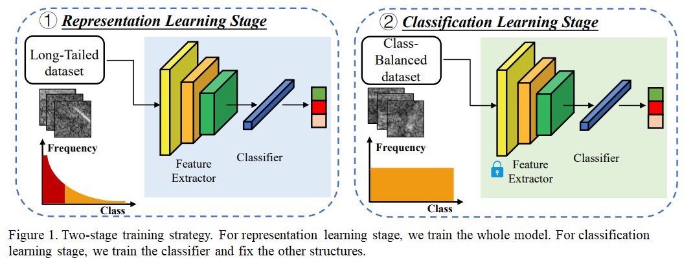

# A Two-Stage Shake-Shake Network for Long-tailed Recognition of SAR Aerial View Objects
4st place solution for the PBVS 2022 Multi-modal Aerial View Object Classification Challenge - Track 1 (SAR)

[Challenge Site](https://codalab.lisn.upsaclay.fr/competitions/1388)

## Overview
Synthetic Aperture Radar (SAR) has received more attention due to its complementary superiority on capturing significant information in the remote sensing area. However, for an Aerial View Object Classification (AVOC) task, SAR images still suffer from the long-tailed distribution of the aerial view objects. This disparity dampens the performance of classification methods, especially for the datasensitive deep learning models. In this paper, we propose a two-stage shake-shake network to tackle the long-tailed learning problem. Specifically, it decouples the learning procedure into the representation learning stage and the classification learning stage. Moreover, we apply the test time augmentation (TTA) and a post-processing approach (CAN) to improve the accuracy. In the PBVS 2022 Multi-modal Aerial View Object Classification Challenge Track 1, our method achieves 21.82% and 27.97% accuracy in the development phase and testing phase respectively, which achieves the top-tier among all the participants.



## Requirements

- Ubuntu (It's only tested on Ubuntu, so it may not work on Windows.)

- Python >= 3.7

- PyTorch >= 1.4.0

- torchvision

  ```shell
  pip install -r requirements.txt
  ```

## Usage

### The first stage training

```shell
python train.py --config ./configs/sar10/shake_shake.yaml
```

- You need to change the value of  “dataset_dir”, “dataset_dir_val”, under the “dataset” field and “output_dir” under the “train” field in the file “./configs/sar10/shake_shake.yaml”。

### The second stage training

```shell
python train.py --config ./configs/sar10/shake_shake_fc.yaml
```

- You need to change the value of  “dataset_dir”, “dataset_dir_val” under the “dataset” field and “output_dir”, “checkpoint” under the “train” field in the file “./configs/sar10/shake_shake_fc.yaml”。

### Test

```shel
python predict_TTA.py 
```

- You need to change the value of  “dataset_dir”, “checkpoint”, under the “test” field  in the file “./configs/sar10/shake_shake.yaml”, then you can find the results in file “.result/results.csv”。
- You can download the trained model [here](https://drive.google.com/file/d/10eLrUocBHfiBotTtkHWFEmJxR66Fcf6j/view?usp=sharing).

## Acknowledge

The codes borrow heavily from [hysts/pytorch_image_classification](https://github.com/hysts/pytorch_image_classification).


